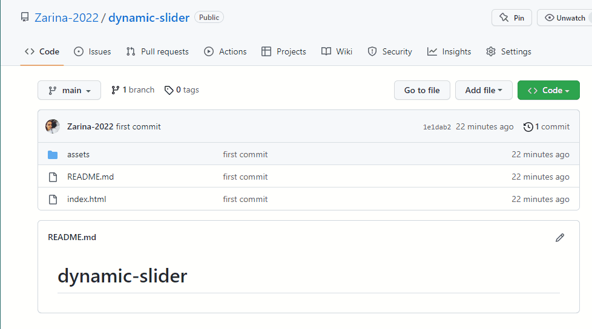

# Dynamic-slider

<h2> <b> A dynamic web page for online ticket sales.</b></h2>

<h3> I used <b>HTML</b> and <b>CSS</b> while preparing this web page.</h3>

<h3>Additionally I used <a href=""><b>Font Awesome</b> </a> (for icons) </h3>

<h3> and <a href=""><b>Bootstrap</b> </a> (for dropdown-menu).</h3>

<h3>Preview of the webpage:</h3>

<h3>Download:</h3>

